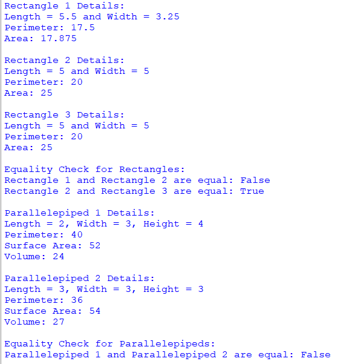

## Description
This program is designed to perform geometric calculations and comparisons of rectangles and parallelepipeds. Utilizing inherited classes for these shapes, the program offers comprehensive functionality to compute surface area, perimeter, and volume.
## Output

